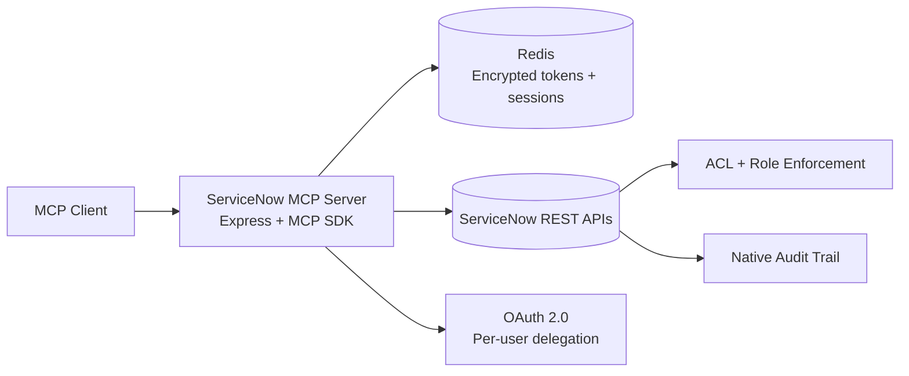

# ServiceNow MCP Server


Secure, enterprise-ready MCP server for ServiceNow where every action runs as the authenticated user.

No shared service accounts. No ACL bypass. Full audit-trail fidelity.

---

## ⚡ Why This Exists

Instead of funneling every request through a shared service account, this server executes actions as the actual human user.

Because it uses **per-user OAuth tokens**, ServiceNow still enforces:

- each user’s ACLs and roles,
- their approval authority,
- and native user-level audit logging.

Result: safer automation, cleaner compliance, fewer permission hacks.

---

## 🔥 Core Capabilities

- Per-user OAuth 2.0 Authorization Code flow + refresh
- AES-256-GCM encrypted token storage in Redis
- Streamable HTTP MCP transport with per-session lifecycle
- Tool-level identity protections for sensitive operations
- Per-user rate limiting via Redis token bucket
- Input validation + normalized error responses
- CI-enforced build + test + coverage gate

---

## 🧠 Architecture



Key modules:

- `src/index.ts` — startup/shutdown wiring
- `src/server.ts` — HTTP app + MCP routes/session lifecycle
- `src/auth/*` — OAuth callback, encryption, token store, token refresh
- `src/tools/*` — tool implementations by domain
- `src/middleware/*` — rate limiting, error normalization
- `src/servicenow/*` — API client + query helpers

---

## 🚀 Quick Start

### Prerequisites

- Node.js 22+
- Redis
- ServiceNow instance with OAuth app configured

### Local Setup

```bash
npm install
cp .env.example .env
npm run generate-key
# paste generated key into TOKEN_ENCRYPTION_KEY in .env
npm run dev
```

Health check:

```bash
curl -s http://localhost:8080/health
```

### Docker

```bash
docker compose up -d --build
```

One-shot Linux VM setup is available via `setup.sh`.

---

## 🛠 ServiceNow Setup

1. Go to **System OAuth > Application Registry**
2. Create **OAuth API endpoint for external clients**
3. Set redirect URI (example): `https://<host>:8080/oauth/callback`
4. Copy client ID/secret into `.env`

### Required Role

Users should have `snc_platform_rest_api_access` for REST API access. Record-level ACLs still apply.

---

## 🧰 Tools (18)

### Incidents

- `search_incidents`
- `get_incident`
- `create_incident`
- `update_incident`
- `add_work_note`

### Users and Groups

- `lookup_user`
- `lookup_group`
- `get_my_profile`

### Knowledge

- `search_knowledge`
- `get_article`

### Tasks and Approvals

- `get_my_tasks`
- `get_my_approvals`
- `approve_or_reject`

### Update Sets

- `change_update_set`
- `create_update_set`

### Service Catalog

- `search_catalog_items`
- `get_catalog_item`
- `submit_catalog_request`

---

## 🔒 Security Guarantees

Server-side protections include:

- `create_incident`: caller identity is server-controlled
- `update_incident`: protected audit/system fields are stripped
- `submit_catalog_request`: requester identity is server-controlled
- `approve_or_reject`: approval ownership is verified

Also enforced:

- `sys_id` and enum validation
- payload sanitization
- normalized error responses

---

## ⚙️ Configuration

| Variable | Required | Description |
|---|---|---|
| `SERVICENOW_INSTANCE_URL` | Yes | ServiceNow base URL |
| `SERVICENOW_CLIENT_ID` | Yes | OAuth client ID |
| `SERVICENOW_CLIENT_SECRET` | Yes | OAuth client secret |
| `OAUTH_REDIRECT_URI` | Yes | OAuth callback URL |
| `TOKEN_ENCRYPTION_KEY` | Yes | Base64 32-byte AES key |
| `REDIS_URL` | No | Redis URL (default `redis://localhost:6379`) |
| `MCP_PORT` | No | Server port (default `8080`) |
| `RATE_LIMIT_PER_USER` | No | Requests/minute/user (default `60`) |

---

## ✅ Testing and Quality

```bash
npm run build
npm test
npm run test:coverage
```

- Coverage thresholds are configured in `vitest.config.ts`
- CI runs build + tests + coverage gate on PRs and `main`

---

## 🧯 Troubleshooting

### 1) OAuth callback fails (`TOKEN_EXCHANGE_FAILED`)

**Symptoms**

- `/oauth/callback` returns 500
- logs show token exchange failure or `invalid_grant`

**Checks**

- `OAUTH_REDIRECT_URI` exactly matches the ServiceNow OAuth app redirect URI
- client ID and secret are correct
- system clock is sane

**Fix**

- correct redirect/client credentials and restart server
- re-run auth flow from `/oauth/authorize`

### 2) Auth works, but API calls return 403

**Symptoms**

- tool calls fail with insufficient permissions

**Checks**

- user has `snc_platform_rest_api_access`
- user has the needed table/record ACL permissions

**Fix**

- grant missing role or ACL permissions in ServiceNow

### 3) Redis connectivity issues

**Symptoms**

- `/health` returns unhealthy
- startup logs show Redis connection errors

**Checks**

- Redis is running and reachable
- `REDIS_URL` is correct

**Fix**

- start Redis
- correct `REDIS_URL`, then restart app

### 4) CI fails on coverage threshold

**Symptoms**

- GitHub Actions fails during `npm run test:coverage`

**Checks**

- inspect uncovered lines in coverage output
- ensure changed logic has matching tests

**Fix**

- add targeted tests
- re-run locally with `npm run test:coverage`

### 5) Tool says `AUTH_REQUIRED` after prior login

**Symptoms**

- tool requests re-auth unexpectedly

**Checks**

- refresh token may be expired/revoked
- session mapping may be missing/expired

**Fix**

- re-authenticate via `/oauth/authorize`
- confirm Redis persistence and restart behavior

### Debug Command Cheat Sheet

```bash
# install + run
npm install
npm run dev

# quality gates
npm run build
npm test
npm run test:coverage

# health check
curl -s http://localhost:8080/health

# local redis quick check (when redis-cli is available)
redis-cli -u "$REDIS_URL" ping

# docker compose stack quick status
docker compose ps
docker compose logs -f
```

---

## 🤖 Agent Instruction Files

- `AGENTS.md`
- `CLAUDE.md`
- `.github/copilot-instructions.md`

Alignment workflow validates expected consistency.

---

## 🌐 Endpoints

| Path | Method | Purpose |
|---|---|---|
| `/health` | GET | Health status |
| `/oauth/authorize` | GET | Start OAuth flow |
| `/oauth/callback` | GET | OAuth callback/token exchange |
| `/mcp` | POST | MCP initialize + tool calls |
| `/mcp` | GET | MCP notifications stream |
| `/mcp` | DELETE | Close MCP session |

---

## Client Config Example (Claude Desktop)

```json
{
  "mcpServers": {
    "servicenow": {
      "type": "streamablehttp",
      "url": "https://your-host:8080/mcp"
    }
  }
}
```

---

Built for secure, user-scoped AI operations in ServiceNow.
