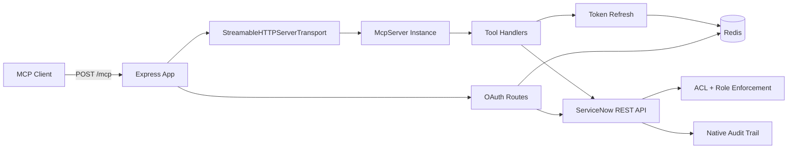

[docs](../README.md) / architecture

# Architecture Overview

The ServiceNow MCP Server is a Node.js application that bridges MCP clients to ServiceNow REST APIs, executing every request as the authenticated user via per-user OAuth 2.0 tokens.

## High-Level Diagram

## Key Design Decisions

- **Per-session McpServer instances**: Each MCP session gets its own `McpServer` + `StreamableHTTPServerTransport` pair, stored in an in-memory `Map<string, SessionEntry>`. See [Session Lifecycle](./session-lifecycle.md).
- **Per-user OAuth tokens**: No shared service accounts. Every API call carries the user's own access token. See [OAuth Flow](../auth/oauth-flow.md).
- **Encrypted token storage**: OAuth tokens are AES-256-GCM encrypted in Redis. See [Token Storage](../auth/token-storage.md).
- **Transparent token refresh**: Expired tokens are refreshed automatically with a distributed lock to prevent races. See [Token Refresh](../auth/token-refresh.md).
- **Reconnect tokens**: Optional session persistence across server restarts. See [Reconnect Tokens](../auth/reconnect-tokens.md).

## Section Index

| Guide | Description |
|---|---|
| [Project Structure](./project-structure.md) | `src/` directory map with file purposes |
| [Session Lifecycle](./session-lifecycle.md) | How sessions are created, maintained, and cleaned up |
| [Request Flow](./request-flow.md) | Trace a tool call from HTTP to ServiceNow and back |
| [Redis Schema](./redis-schema.md) | All 7 Redis key patterns with TTLs and data shapes |

---

**See also**: [Getting Started](../getting-started/README.md) · [Security Overview](../security/README.md) · [Endpoints](../api/endpoints.md)
