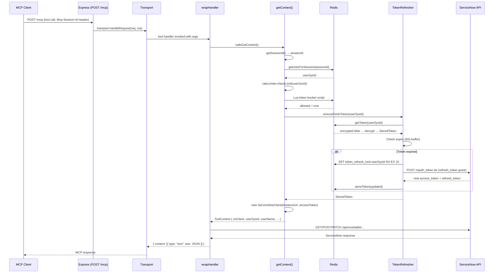

[docs](../README.md) / [architecture](./README.md) / request-flow

# Request Flow

This traces a tool call from the HTTP request through to the ServiceNow API response.

## Sequence

## Step-by-Step

### 1. HTTP Routing (`src/server.ts`)

`POST /mcp` checks the `Mcp-Session-Id` header. If the session exists, the request is routed to that session's `StreamableHTTPServerTransport`.

### 2. Tool Dispatch (MCP SDK)

The transport deserializes the MCP request and dispatches it to the registered tool handler via the `McpServer`.

### 3. Context Resolution (`src/tools/registry.ts`)

`wrapHandler` calls `safeGetContext()`, which:

1. **Gets the session ID** from the closure (`getSessionId()`)
2. **Resolves the user** via Redis session mapping (`session:<id>` → `user_sys_id`)
3. **Checks rate limit** via the [token bucket](../security/rate-limiting.md) Lua script
4. **Ensures a fresh token** via [TokenRefresher](../auth/token-refresh.md) (refreshes if within 60s of expiry)
5. **Creates a ServiceNowClient** with the user's access token
6. **Returns a ToolContext** with the client, instance URL, and user identity

If any step fails, an appropriate error (`AUTH_REQUIRED`, `RATE_LIMITED`) is returned.

### 4. Tool Execution (`src/tools/*.ts`)

The tool handler receives `(ctx: ToolContext, args: T)` and uses `ctx.snClient` to make ServiceNow REST API calls. The response is shaped into the tool's return format.

### 5. Error Wrapping (`src/tools/registry.ts`)

`wrapHandler` catches all errors and maps them through `handleToolError()` into a consistent `ToolError` shape. See [Error Handling](../security/error-handling.md).

### 6. Response

The tool result is serialized as `{ content: [{ type: "text", text: JSON.stringify(result) }] }` and sent back to the client via the transport.

---

**See also**: [Session Lifecycle](./session-lifecycle.md) · [Token Refresh](../auth/token-refresh.md) · [Error Handling](../security/error-handling.md)
