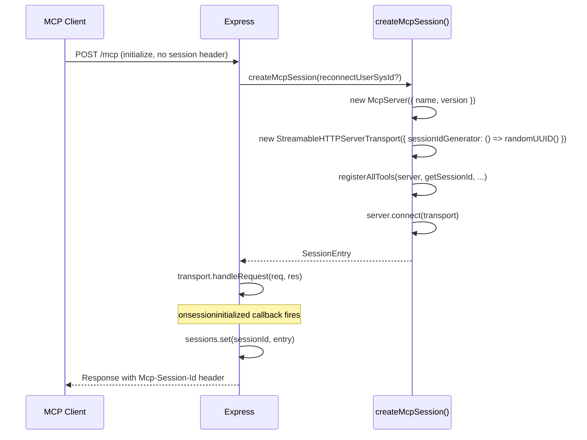

[docs](../README.md) / [architecture](./README.md) / session-lifecycle

# Session Lifecycle

Each MCP session gets its own `McpServer` + `StreamableHTTPServerTransport` pair. Sessions are stored in an in-memory `Map<string, SessionEntry>`.

## SessionEntry

```typescript
interface SessionEntry {
  transport: StreamableHTTPServerTransport;
  server: McpServer;
  createdAt: number;
}
```

## Session Creation

A new session is created when `POST /mcp` arrives **without** a recognized `Mcp-Session-Id` header (i.e., an `initialize` request).



## Existing Session Routing

When `POST /mcp` arrives **with** a known `Mcp-Session-Id`, the request is routed directly to the existing session's transport:

```typescript
const entry = sessions.get(sessionId);
await entry.transport.handleRequest(req, res);
```

## SSE Notifications (GET /mcp)

`GET /mcp` with a valid `Mcp-Session-Id` opens an SSE stream for server-to-client notifications, handled by the same transport instance.

## Session Termination

Sessions end in one of three ways:

| Trigger | Mechanism |
|---|---|
| Client sends `DELETE /mcp` | `transport.close()` is called, session removed from map |
| Transport closes naturally | `transport.onclose` callback removes the session |
| Server restart | In-memory map is lost; clients must reconnect and re-authenticate via MCP OAuth |

## User Resolution

The session ID alone doesn't identify a user. User identity comes from the `Authorization: Bearer` token on each request. The `requireBearerAuth` middleware verifies the MCP access token and provides `authInfo` (containing `userSysId`) to the tool context.

When a tool executes, `getContext()` resolves `authInfo.userSysId → StoredToken → ServiceNowClient`.

---

**See also**: [Request Flow](./request-flow.md) · [Redis Schema](./redis-schema.md) · [OAuth Flow](../auth/oauth-flow.md)
