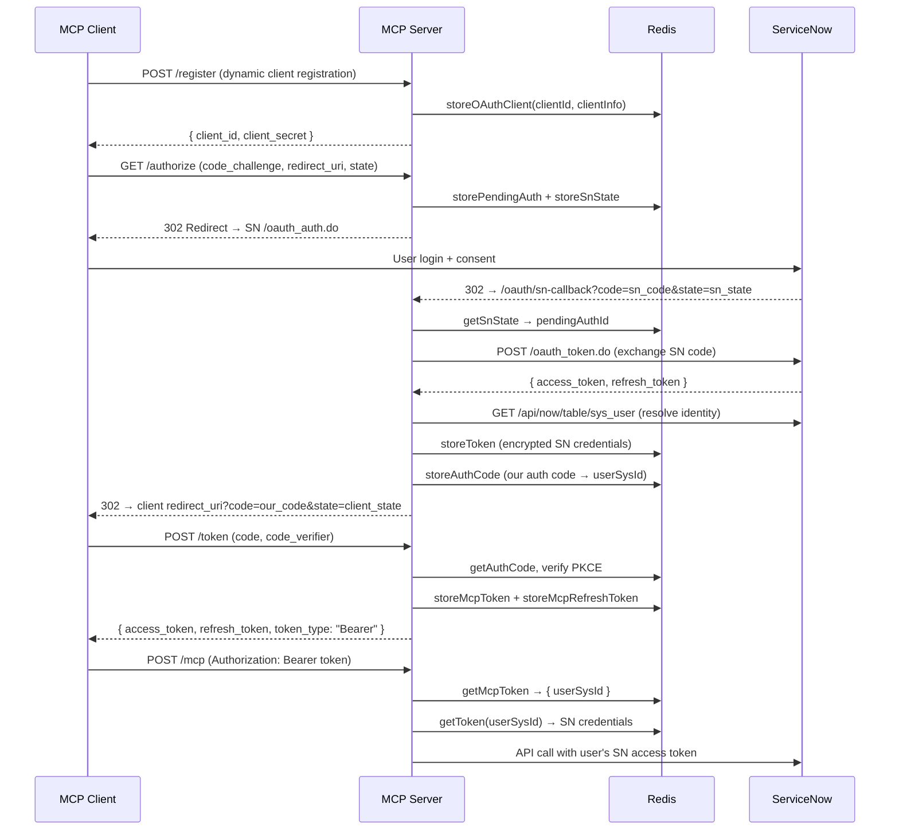

[docs](../README.md) / [auth](./README.md) / oauth-flow

# OAuth Flow

The server acts as an **OAuth authorization server** (per the MCP spec) and delegates user authentication to ServiceNow. MCP clients use standard OAuth 2.0 with PKCE to obtain bearer tokens.

## Flow Diagram (SDK OAuth)

## Step-by-Step

### 1. Client Registration (`POST /register`)

MCP clients register dynamically via RFC 7591. The server generates a `client_id` (UUID) and `client_secret` (32-byte hex), stores them in Redis (90-day TTL).

### 2. Authorization (`GET /authorize`)

The SDK's authorization handler validates the request (PKCE `code_challenge`, `redirect_uri`, `state`), then calls our `OAuthServerProvider.authorize()`:

1. Generates a `pending_auth` ID, stores client params in Redis (10-min TTL)
2. Generates a CSRF `sn_state`, stores in Redis (10-min TTL)
3. Redirects user to ServiceNow's `/oauth_auth.do`

### 3. ServiceNow Callback (`GET /oauth/sn-callback`)

After the user authorizes on ServiceNow:

1. Validates `sn_state` against Redis (one-time use)
2. Exchanges SN authorization code for SN tokens
3. Resolves user identity via `gs.getUserName()` query
4. Stores encrypted SN token in Redis
5. Generates our authorization code (32-byte hex), stores in Redis (5-min TTL)
6. Redirects back to the MCP client's `redirect_uri` with our code and original state

### 4. Token Exchange (`POST /token`)

The SDK's token handler validates the request, verifies PKCE, then calls `exchangeAuthorizationCode()`:

1. Looks up and consumes the authorization code (one-time use)
2. Generates opaque MCP access token (1-hour TTL) and refresh token (30-day TTL)
3. Returns `{ access_token, token_type: "Bearer", expires_in, refresh_token }`

### 5. Bearer Auth on `/mcp`

Every `/mcp` request requires `Authorization: Bearer <token>`. The `requireBearerAuth` middleware calls `verifyAccessToken()`, which looks up the MCP token in Redis and returns `AuthInfo` with `extra.userSysId`. Tool handlers use this to resolve the user's SN credentials.

### 6. Token Refresh (`POST /token` with `grant_type=refresh_token`)

When the MCP access token expires, the client uses the refresh token to get a new one. The server verifies the user still has valid SN credentials before issuing a new MCP token.

## Legacy Flow (Deprecated)

The previous `GET /oauth/authorize` → `GET /oauth/callback` → session mapping flow is still functional but deprecated. It logs warnings and will be removed in a future release.

## Error Cases

| Error | Cause |
|---|---|
| `SN_OAUTH_ERROR` | ServiceNow returned an error in the sn-callback |
| `INVALID_CALLBACK` | Missing `code` or `state` parameter |
| `INVALID_STATE` | SN state not found in Redis (expired or tampered) |
| `EXPIRED_AUTH` | Pending authorization expired before SN callback |
| `TOKEN_EXCHANGE_FAILED` | SN code exchange failed |
| `invalid_grant` | Authorization code or refresh token invalid/expired |
| `invalid_token` | MCP access token invalid or expired |

---

**See also**: [Token Storage](./token-storage.md) · [ServiceNow OAuth Setup](../getting-started/servicenow-oauth-setup.md) · [Troubleshooting](../troubleshooting/README.md)
