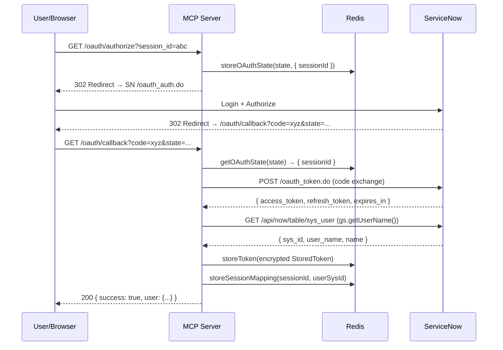

[docs](../README.md) / [auth](./README.md) / oauth-flow

# OAuth Flow

The server implements the **OAuth 2.0 Authorization Code** grant type with ServiceNow as the authorization server.

## Flow Diagram

## Step-by-Step

### 1. Authorize (`GET /oauth/authorize`)

Generates a cryptographically random 32-byte state parameter for CSRF protection, stores it in Redis (10-minute TTL), and redirects the user to ServiceNow's OAuth authorization endpoint.

**Query parameters**:
- `session_id` (optional) — the MCP session ID to map after successful auth

**Redirect URL**: `{SERVICENOW_INSTANCE_URL}/oauth_auth.do?response_type=code&client_id=...&redirect_uri=...&state=...`

### 2. Callback (`GET /oauth/callback`)

Receives the authorization code from ServiceNow after user consent.

**Validation**:
1. Checks for OAuth errors from ServiceNow
2. Verifies `code` and `state` parameters are present
3. Validates state against Redis (one-time use — deleted on read)

**Token exchange**: POSTs to `{SERVICENOW_INSTANCE_URL}/oauth_token.do` with:
- `grant_type=authorization_code`
- `code`, `redirect_uri`, `client_id`, `client_secret`

**User resolution**: After obtaining tokens, queries `sys_user` with `gs.getUserName()` to determine the token owner's `sys_id`, `user_name`, and display name.

**Storage**:
- Encrypts and stores the `StoredToken` in Redis (see [Token Storage](./token-storage.md))
- Maps the session to the user if `session_id` was provided

### 3. Tool Calls Use the Token

When a tool executes, `getContext()` resolves `session → user → token → ServiceNowClient`. See [Request Flow](../architecture/request-flow.md).

## CSRF Protection

The `state` parameter prevents cross-site request forgery:

- Generated with `crypto.randomBytes(32).toString("hex")` (256-bit entropy)
- Stored in Redis with a 10-minute TTL (`oauth_state:<state>`)
- Consumed on first read (one-time use)
- If the state doesn't match, the callback returns `INVALID_STATE`

## Error Cases

| Error | Cause |
|---|---|
| `OAUTH_ERROR` | ServiceNow returned an error in the callback |
| `INVALID_CALLBACK` | Missing `code` or `state` parameter |
| `INVALID_STATE` | State not found in Redis (expired or tampered) |
| `TOKEN_EXCHANGE_FAILED` | Code exchange with ServiceNow failed (wrong credentials, expired code, redirect URI mismatch) |

---

**See also**: [Token Storage](./token-storage.md) · [ServiceNow OAuth Setup](../getting-started/servicenow-oauth-setup.md) · [Troubleshooting](../troubleshooting/README.md)
