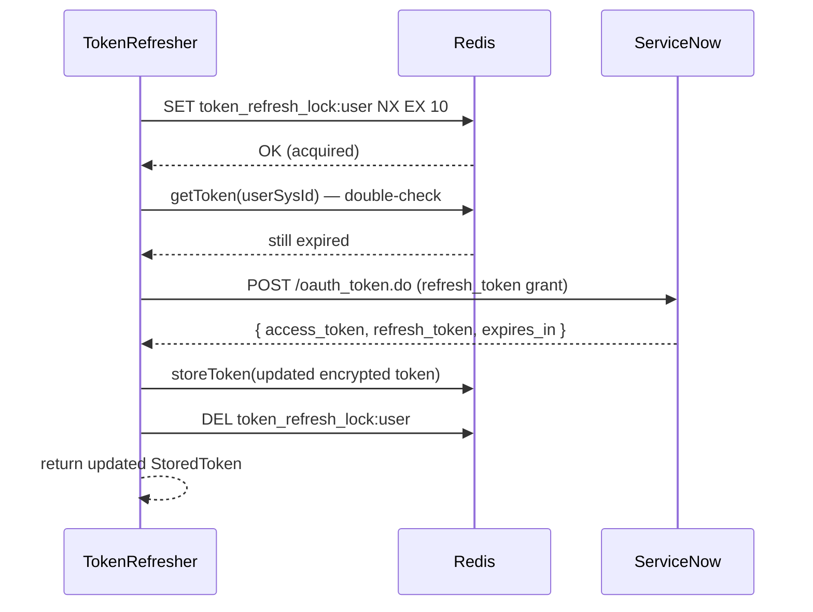

[docs](../README.md) / [auth](./README.md) / token-refresh

# Token Refresh

Access tokens are automatically refreshed when they expire, using the stored refresh token. A distributed lock prevents concurrent refresh races.

## When Refresh Happens

`TokenRefresher.ensureFreshToken(userSysId)` is called on every tool invocation (via `getContext()`). It checks:

```
if (token.expires_at - now > 60) → return token (still valid)
else → refreshWithLock(userSysId, token)
```

The 60-second buffer ensures the token won't expire mid-request.

## Distributed Lock

Multiple concurrent requests for the same user could trigger simultaneous refresh attempts. The server uses a Redis distributed lock to serialize them:

```typescript
const lockKey = `token_refresh_lock:${userSysId}`;
const acquired = await redis.set(lockKey, "1", "EX", 10, "NX");
```

| Scenario | Behavior |
|---|---|
| Lock acquired | Proceed with refresh, release lock in `finally` |
| Lock not acquired | Wait 1 second, re-read token from Redis (another request likely refreshed it) |
| Lock holder crashes | Lock auto-expires after 10 seconds |

### Double-Check After Lock

After acquiring the lock, the refresher re-reads the token from Redis. If another request refreshed it in the meantime, the fresh token is returned without making another ServiceNow call.

## Refresh Flow



## Error Handling

| ServiceNow Response | Action |
|---|---|
| 200 OK | Store new tokens, return updated `StoredToken` |
| 400 or 401 | Refresh token is invalid/revoked — delete stored tokens, throw `AuthRequiredError` |
| Other errors | Re-throw (tool handler wraps it as `UNEXPECTED_ERROR`) |

## AuthRequiredError

When authentication is needed (no token found, refresh failed, no session mapping):

```typescript
class AuthRequiredError extends Error {
  code = "AUTH_REQUIRED";
  constructor(userSysId?: string) { ... }
}
```

The `safeGetContext()` wrapper in the registry catches this and returns a response with the OAuth authorize URL, prompting the user to re-authenticate.

---

**See also**: [Token Storage](./token-storage.md) · [Redis Schema](../architecture/redis-schema.md) · [Request Flow](../architecture/request-flow.md)
